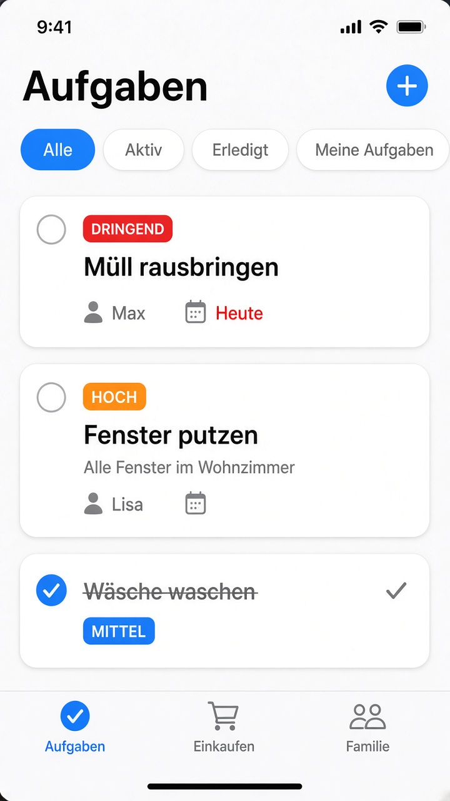
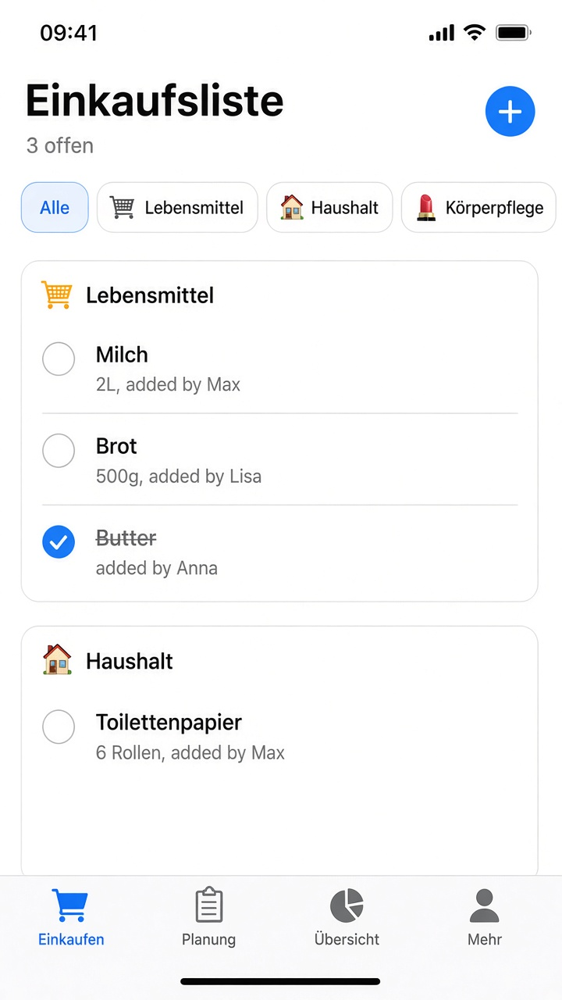
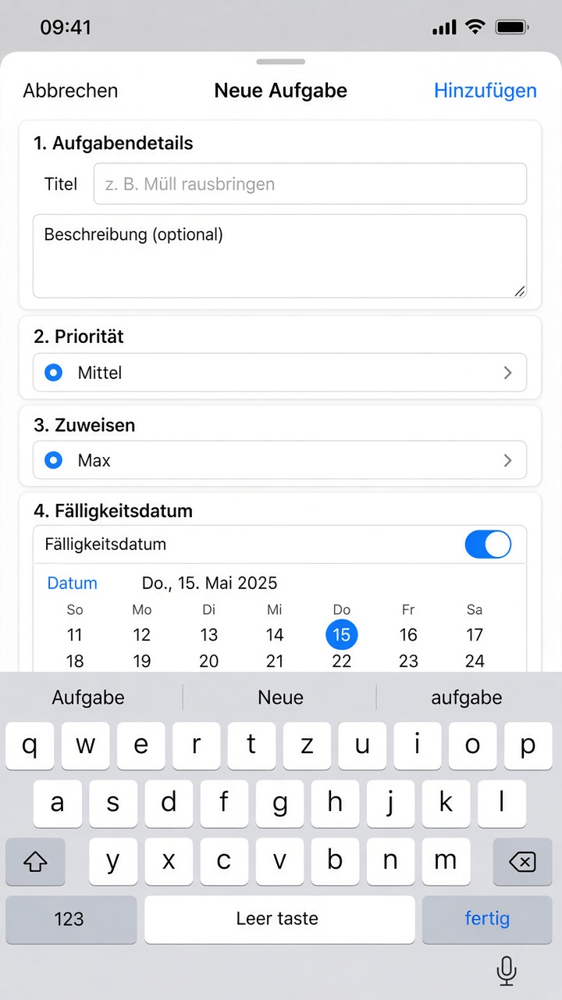
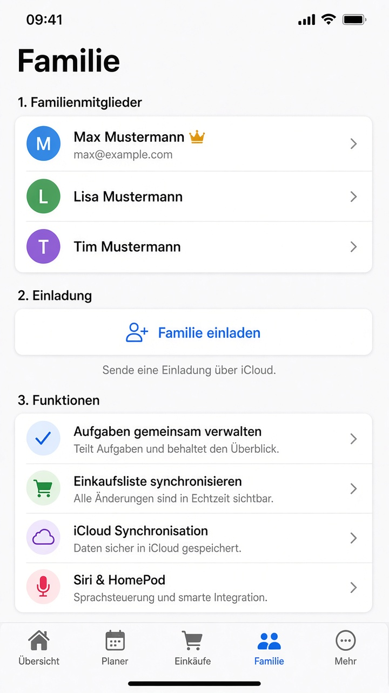
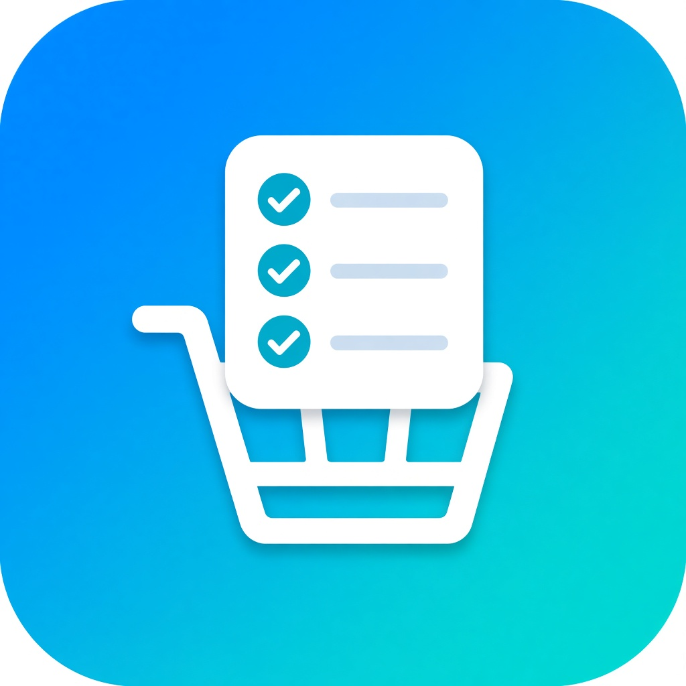
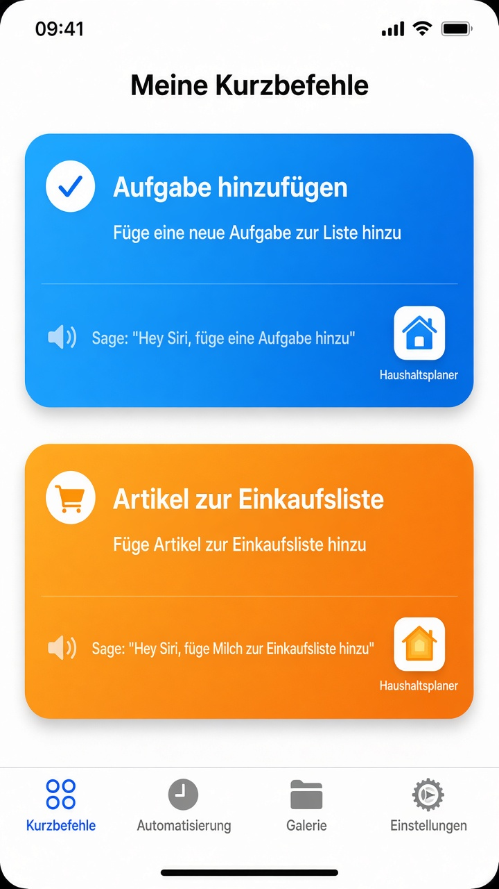
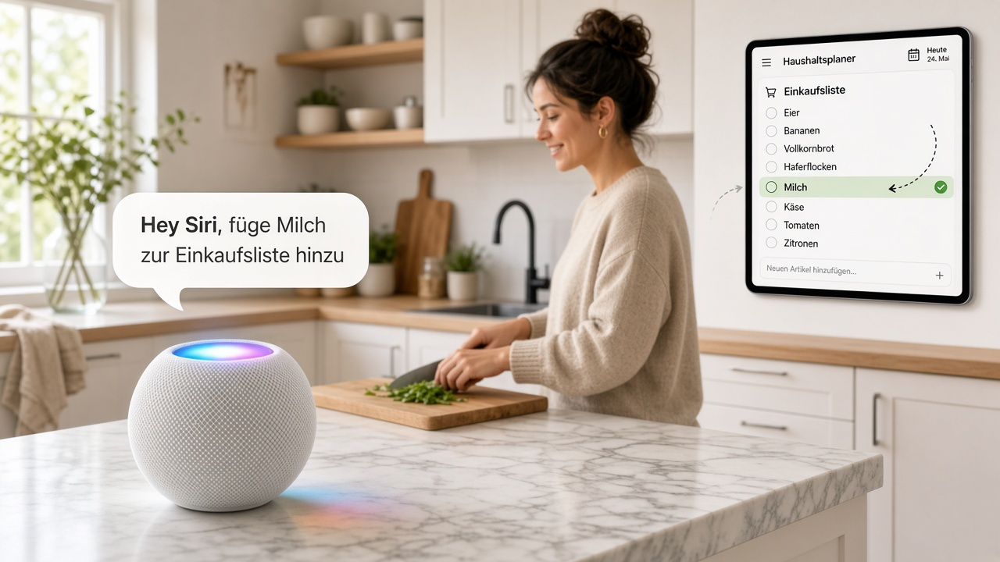
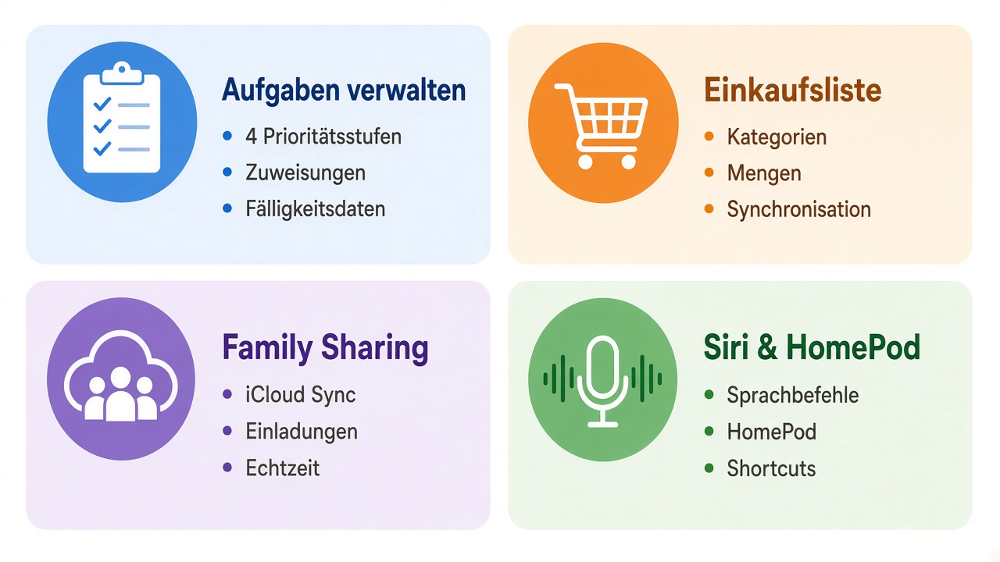

# 🎨 Design Mockups - Haushaltsplaner App

Diese Mockups zeigen die fertige Benutzeroberfläche der Haushaltsplaner iOS-App.

## 📱 App Screens

### 1. Aufgaben-Übersicht

**Hauptfeatures:**
- ✅ Horizontale Filter-Leiste (Alle, Aktiv, Erledigt, Meine Aufgaben)
- 🎨 Farbcodierte Prioritäten
  - 🔴 Dringend (Rot)
  - 🟠 Hoch (Orange)
  - 🔵 Mittel (Blau)
  - 🟢 Niedrig (Grün)
- 👤 Zugewiesene Person sichtbar
- 📅 Fälligkeitsdatum mit Icon
- ✓ Checkbox zum Abhaken
- 🗑️ Swipe-to-Delete

**UX-Details:**
- Pull-to-Refresh für Synchronisation
- Smooth Animations beim Abhaken
- Empty State mit Call-to-Action
- Plus-Button oben rechts

---

### 2. Einkaufsliste

**Hauptfeatures:**
- 🏷️ Kategoriefilter mit Emojis
  - 🛒 Lebensmittel
  - 🏠 Haushalt
  - 💄 Körperpflege
  - 📦 Sonstiges
- 📝 Mengenangaben (2L, 500g, etc.)
- 👤 "Hinzugefügt von" Info
- ✓ Als gekauft markieren
- 🗂️ Nach Kategorien gruppiert

**UX-Details:**
- Gekaufte Artikel durchgestrichen
- Counter zeigt offene Artikel
- Kategorien mit Icons und Farben
- Swipe-to-Delete

---

### 3. Aufgabe hinzufügen (Modal)

**Formular-Felder:**
- 📝 Titel (Pflichtfeld)
- 📄 Beschreibung (Optional, mehrere Zeilen)
- 🎯 Priorität (Dropdown mit Farbvorschau)
- 👤 Zuweisen an (Familienmitglied auswählen)
- 📅 Fälligkeitsdatum (Toggle + DatePicker)

**UX-Details:**
- Modal Sheet von unten
- Abbrechen / Hinzufügen Buttons
- Hinzufügen-Button deaktiviert wenn Titel leer
- Deutsche Tastatur
- Gruppierte Sektionen (iOS Standard)

---

### 4. Familien-Verwaltung

**Mitglieder-Liste:**
- 🎨 Farbcodierte Avatare mit Initialen
- 👑 Owner mit Kronen-Icon
- 📧 E-Mail optional sichtbar
- 🎭 Jedes Mitglied hat eigene Farbe

**Einladung:**
- ➕ "Familie einladen" Button
- 🔗 iCloud-Link teilen
- 📱 Via Nachrichten, Mail, etc.

**Feature-Übersicht:**
- ✅ Aufgaben gemeinsam verwalten
- 🛒 Einkaufsliste synchronisieren
- ☁️ iCloud Synchronisation
- 🎙️ Siri & HomePod Integration

---

## 🎨 Design Assets

### App Icon

**Design-Elemente:**
- 📱 iOS-Rounded-Square Shape
- 🎨 Gradient: Blau (#007AFF) → Türkis (#00C7BE)
- ✓ Checklist-Icon
- 🛒 Shopping-Cart-Icon
- Minimalistisch, modern, einprägsam

**Anwendung:**
- App Store Icon
- Home Screen
- Einstellungen
- Benachrichtigungen

---

## 🎙️ Siri & HomePod Integration

### Siri Shortcuts

**Verfügbare Shortcuts:**

1. **Aufgabe hinzufügen**
   - Phrase: "Hey Siri, füge eine Aufgabe hinzu"
   - Icon: Checkmark
   - Farbe: Blau

2. **Artikel zur Einkaufsliste**
   - Phrase: "Hey Siri, füge Milch zur Einkaufsliste hinzu"
   - Icon: Shopping Cart
   - Farbe: Orange

**Verwendung:**
- iPhone, iPad, Apple Watch
- HomePod, HomePod mini
- CarPlay
- Mac (mit Apple Silicon)

---

### HomePod Use Case

**Szenario: Kochen in der Küche**
1. 👨‍🍳 Person kocht
2. 🗣️ "Hey Siri, füge Milch zur Einkaufsliste hinzu"
3. 🔊 HomePod bestätigt
4. 📱 iPad zeigt Update in Echtzeit
5. ✅ Artikel ist für alle Familienmitglieder sichtbar

**Vorteile:**
- Hände frei beim Kochen
- Sofort eintragen, nichts vergessen
- Ganze Familie sieht Updates
- Natürliche Sprache

---

## 📊 Features Übersicht

### 1. Aufgaben verwalten (Blau)
- ✅ 4 Prioritätsstufen
- 👤 Zuweisungen
- 📅 Fälligkeitsdaten
- ✓ Erledigungs-Tracking

### 2. Einkaufsliste (Orange)
- 🏷️ Kategorien
- 📝 Mengen
- 🔄 Synchronisation
- ✓ Gekauft-Status

### 3. Family Sharing (Lila)
- ☁️ iCloud Sync
- 📨 Einladungen
- ⚡ Echtzeit-Updates
- 🔒 Sicher & Privat

### 4. Siri & HomePod (Grün)
- 🗣️ Sprachbefehle
- 🔊 HomePod
- ⚡ Shortcuts
- 🤖 Automation

---

## 🎨 Design System

### Farben

**Primär:**
- Blau: `#007AFF` (iOS Standard)
- Türkis: `#00C7BE` (Akzent)

**Prioritäten:**
- Niedrig: `#34C759` (Grün)
- Mittel: `#007AFF` (Blau)
- Hoch: `#FF9500` (Orange)
- Dringend: `#FF3B30` (Rot)

**Hintergrund:**
- Light Mode: `#FFFFFF` (Weiß)
- Dark Mode: `#000000` (Schwarz)
- Sekundär: `#F2F2F7` (Grau)

### Typografie

**SF Pro Display:**
- Large Title: 34pt Bold
- Title: 28pt Bold
- Headline: 17pt Semibold
- Body: 17pt Regular
- Caption: 12pt Regular

### Icons

**SF Symbols:**
- Checkmark.circle.fill
- Cart.fill
- Person.3.fill
- Plus
- Calendar
- Mic.fill

### Spacing

- XS: 4pt
- S: 8pt
- M: 12pt
- L: 16pt
- XL: 24pt
- XXL: 32pt

### Corner Radius

- Buttons: 12pt
- Cards: 16pt
- Sheets: 20pt
- Chips: 20pt (vollständig gerundet)

---

## 📱 Responsive Design

### iPhone
- Optimiert für alle Größen
- Portrait & Landscape
- Safe Area berücksichtigt
- Dynamic Type Support

### iPad
- Split View fähig
- Sidebar auf großen Displays
- Multitasking-ready
- Apple Pencil Support (geplant)

---

## ♿ Accessibility

- ✅ VoiceOver Support
- ✅ Dynamic Type
- ✅ High Contrast Mode
- ✅ Reduce Motion
- ✅ Button Shapes
- ✅ On/Off Labels

---

## 🎬 Animationen

### Transitions
- Modal Sheets: Slide von unten
- Navigation: Slide von rechts
- Tab Switch: Cross Fade

### Micro-Interactions
- Checkbox Toggle: Scale + Bounce
- Pull-to-Refresh: Elastic
- Swipe-to-Delete: Slide + Fade
- Add Item: Scale In

### Durations
- Fast: 0.2s
- Normal: 0.3s
- Slow: 0.5s

---

## 📐 Grid & Layout

### List Items
- Height: 60-80pt (dynamisch)
- Padding: 16pt horizontal, 12pt vertikal
- Spacing: 8pt zwischen Items

### Buttons
- Height: 44pt (minimum touch target)
- Padding: 12pt horizontal
- Full Width: bei Primary Actions

### Forms
- Input Height: 44pt
- Section Spacing: 24pt
- Label Spacing: 8pt

---

## 🎯 Design Principles

1. **Clarity** - Klare Hierarchie und Lesbarkeit
2. **Deference** - UI steht nicht im Weg
3. **Depth** - Layering für Kontext
4. **Simplicity** - Nur das Notwendigste
5. **Consistency** - iOS Design Guidelines
6. **Accessibility** - Für alle nutzbar

---

**Design-Tool:** Erstellt mit SwiftUI
**Icons:** SF Symbols 5
**Font:** SF Pro (System Font)
**Platform:** iOS 17.0+
